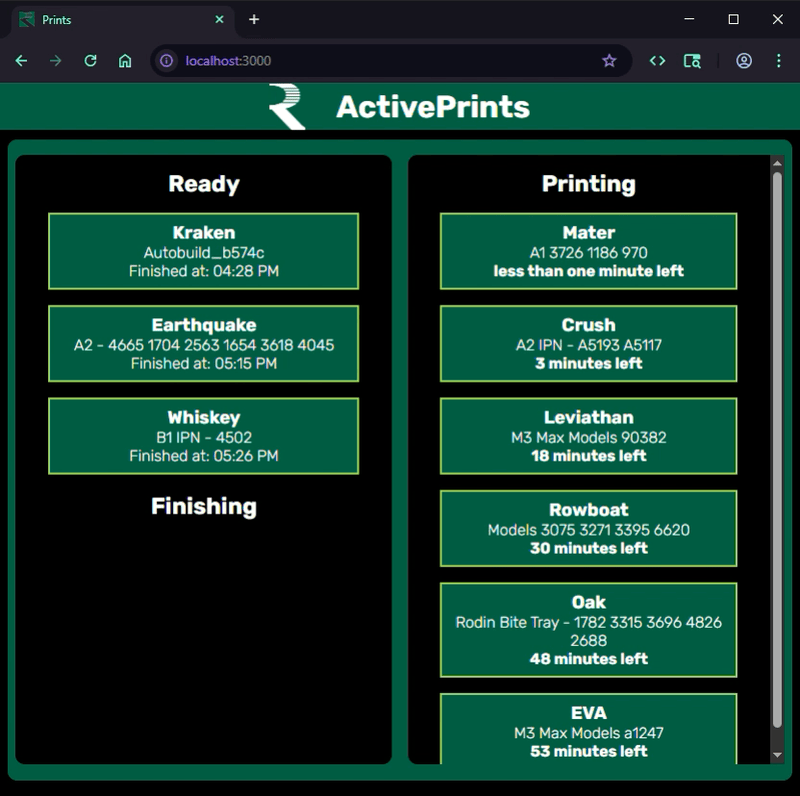

# ROEPrints

## Application to display print jobs that are currently printing or ready to be pulled.

(React - Vite, Typescript, Express, Python/Flask)

ToDo

    - adjust colors of container headers for better contrast or add backgrounds
    - fix finishing print logic to avoid showing old time prior to API fully updating
    - provide names for unnanmed printers via Carbon web interface
    - write python/flask server for backend production logic
    - move typescript interfaces for CarbonAPI data to separate file to be pulled into express server and CarbonAPI element
    - convert express server to typescript
    - separate API call and data processing from CarbonAPI element into separate components
    - fix error that server crashes upon unsuccessful API call (pm2? error handling?)
    - adjust environment variable naming
    - set up CI/CD pipeline to prepare for deployment
    - dockerize app and servers?
    - pull Asiga printer data and integrate
